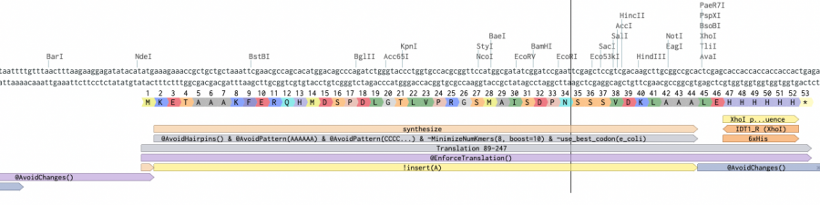

# domesticator_3

## Intro

A reverse translation tool written by [Ryan Kibler](rdkibler@gmail.com?subject=Domesticator3) (rdkibler). It uses the powerful codon optimization library [dnachisel](https://github.com/Edinburgh-Genome-Foundry/DnaChisel/tree/master) with several custom objectives and constraints. It is meant to fully automate the gene ordering process short of actually submitting the order to your DNA synthesis company of choice as well as compile some useful information about the translated genes. However, Ryan does not take any responsibility for unintended consequences of using domesticator3 – that is entirely the user's responsibility. **Always double check your orders!** Domesticator3 is currently a work in progress. Follow its development on [github](https://github.com/rdkibler/domesticator_3).


### Basic Usage 

The tool currently lives under ''/home/rdkibler/projects/dom_dev/domesticator3/domesticator3''. It supports both fasta files and pdb files as inputs and requires a backbone vector files in genbank format to control the behavior of the optimizer. See [[:protocols:dry_lab:genes:codon_optimization:domesticator3#vector_files|vector files]] for details.

Here is a basic example:

```bash
/software/domesticator3/domesticator3 my_design.pdb /software/domesticator3/vectors/standard/pET29b.gb
```

Domesticator is non-deterministic, so by default it will optimize each sequence multiple times and pick the best one to output. The number of optimizations to try is controlled by the ''–nstruct'' flag

### IDT gBlockComplexityAnalysis 

This script can use IDT's gBlockComplexityAnalysis API to check the synthesizability of a fragment. This isn't the same calculator used to compute synthesizability of pre-cloned genes, but it's similar. This is used to select the best sequence to output based on synthesizability. You can turn this off with the ''–no_idt'' flag The first time you use the script, it will request that you apply for the [IDT API program](https://www.idtdna.com/pages/tools/apidoc) and enter the details. The details are stored in a file readable only to you under ''~/.domesticator/info.json''. As long as the ''info.json'' file is intact, you will never need to do this again.

### Protein Sequences 

Domesticator currently supports multichain PDBs and FASTA files as the input types. For multichain PDBs, each chain is separately extracted and inserted into a new copy of the base vector. If the base vector supports multiple chains (either via multiple CDSs or a multi-cistronic setup), then the chains will be inserted into the same vector at the appropriate positions.

Each sequence in a FASTA file will be inserted into a new copy of the base vector. Domesticator3 currently does not support inserting multiple sequences into the same vector file if those sequences came from a FASTA file.

**WARNING FOR HOMO-N-MER DESIGNERS**: Domesticator does not detect duplicate sequences, so if you give it a PDB containing the symmetric structure instead of the ASU, it will insert each chain into the base vector individually and you may end up ordering N copies of your design instead of one.


### Vector Files 

Genbank vector files handle almost all customization of the codon optimization via feature parsing by dnachisel's [Genbank API](https://edinburgh-genome-foundry.github.io/DnaChisel/genbank/genbank_api.html).

The position at which an input sequences gets inserted is a feature with type "misc_feature" and label having the form `!insert(<chain_letter>)` where <chain_letter> is a string corresponding to the PDB chain ID of the chain you wish to insert. For example, to insert chain A of a PDB file, use `insert(A)` The chain ID of sequences from FASTA files is assumed to be "A".

The minimum set of other specifications one should include are listed here:
  * @AvoidHairpins()
  * @AvoidPattern(AAAAAA)
  * @AvoidPattern(CCCCCC)
  * @AvoidPattern(GGGGGG)
  * @AvoidPattern(TTTTTT)
  * @EnforceGCContent(25-80%/50bp)
  * @EnforceGCContent(40-65%)
  * ~MinimizeNumKmers(8, boost=10)
  * ~use_best_codon(e_coli)
  * @EnforceTranslation() Over the coding sequence
  * @AvoidChanges() everywhere except the the insertion site

A collection of vector files formatted for controlling domesticator3 are available for use at domesticator3/vectors. These include all the common vectors available under IDT, the Duet-1 vectors available from genscript, and the Lucy vectors available from genscript.

Features with the type "protein" between an annotated "start" feature with type "domesticator" and an in-frame stop codon will be used for naming proteins.

## Outputs

### Orderable Sequences 
Sequences under a feature of type "domesticator" and label "synthesize" will be extracted and saved as a FASTA file named ''order.dna.fasta'' which should be ready to order after user review. Ordering these gene fragments pre-cloned into the vector should result in the ordered plasmid having a seqeunce identical to the output vector genbank file of the corresponding design, assuming the input vector file is accurate.

### Output Vector

Domesticator outputs the complete vector file including your inserts for your record keeping purposes. This file retains the constraints and objectives used to optimize the sequence as features. It also names the inserted fragment after the name of the seqeunce from the input PDB or FASTA file. This file is named according to the name of the sequence and the vector file. Each complete optimized vector will output one vector genbank file.

### Protein Parameters

Domesticator3 automatically detects your translated protein in full, including tags encoded on the vector and not on the DNA fragment to be synthesized. These proteins are named according to "protein" type features along the sequence, and protparam values are automatically generated and saved to the file ''translated_proteins.params''.

## Bugs and Feature Requests

Please request access to the [github repo](https://github.com/rdkibler/domesticator_3) and use the Issues feature to report bugs and request new features. This is preferred to email Ryan in case someone else takes up maintance of the script.


## FAQs 
Q:  A couple of questions about the vector input file.   In my case, I am codon optimizing sequences for expression in h_sapiens jurkat cells.  Is the only thing that I need to change the annotation  ~use_best_codon(e_coli)?  to ~use_best_codon(h_sapiens)?

A:  Essentially yes. There are a few extra eukaryote-specific things that probably should be added for your case like avoiding splicing sites and eukaryotic alternative start sites and things like that, but all that is just liberal use of @AvoidPattern(NNN) that should be pretty straightforward to figure out if you know the patterns to avoid if you want to avoid. 

Q:  Also, why is there overlap between the annotations included in the ORF region (i.e. @EnforceTranslation()) and the vector regions (i.e. @AvoidChanges()) in the example vector file pET29b+?  

A:  It doesn't matter a whole lot. Since nothing can change in the AvoidChanges regions, translation will always be enforced anyway where it overlaps with EnforceTranslation. But I like to add it because it helps show what is going to be translated by the cell. 

Q:  What should the annotations of my input vector file look like?

A:  


